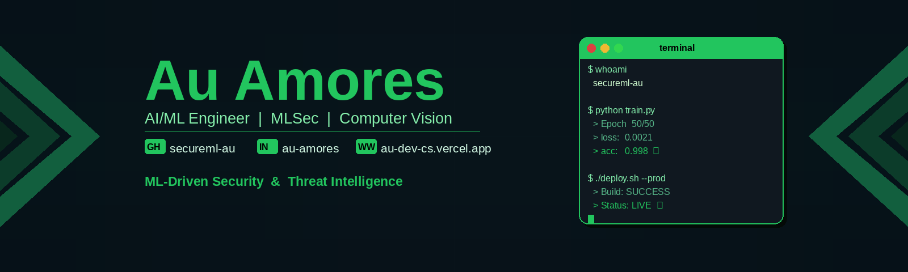

  

 

<!-- STATUS BADGES ROW -->

  

<!-- PROFILE VIEWS + SOCIALS -->

---

---

##  `>> capabilities --scan`

| Deep Learning | Computer Vision | ML Security | Full Stack |
|:---:|:---:|:---:|:---:|
| CNN / SVM / Hybrid | Real-time YOLO | PhishGuard AI | Next.js / React |
| PyTorch · TensorFlow | OpenCV Pipelines | SQL Injection ML | Flask / FastAPI |
| ONNX Quantization | MobileNetV2 / EfficientNet | NLP Threat Intel | PostgreSQL / MySQL |
| Transfer Learning | Vision Transformers | Adversarial Defense | Docker / Vercel |
| Model Fine-tuning | MediaPipe / Haarcascade | JWT Zero-Trust | Tailwind / Bootstrap |

---

## `> ls projects/ --pinned`

### FLAGSHIP SYSTEMS

<table>
<tr>
<td width="50%" valign="top">

#### Alcohol Intoxication Detection
**`CNN + SVM + Hybrid | 98.4% ACC`**

AI-powered facial analysis detecting alcohol intoxication in real-time. Complete on-device CV pipeline with biometric feature extraction deployed on Android.

**Stack:**
`Python` `OpenCV` `CNN` `SVM` `PyTorch` `TensorFlow` `Colab` `Kaggle` `Android Studio`

</td>
<td width="50%" valign="top">

#### PhishGuard AI Scanner
**`NLP | Real-time | 98.4% F1`**

Enterprise-grade phishing detection using Transformer + ONNX. Flask REST backend + Android frontend with sub-15ms inference latency.

**Stack:**
`Python` `Flask` `TensorFlow` `Keras` `NLP` `Java` `Android Studio` `VS Code`

</td>
</tr>
<tr>
<td width="50%" valign="top">

#### Malicious URL Detection
**`Random Forest + XGBoost + SVM | 96.2% ACC`**

Multi-algorithm URL threat intelligence platform classifying malicious web links with <100ms latency.

**Stack:**
`Python` `Scikit-Learn` `XGBoost` `Pandas` `Streamlit` `Jupyter`

</td>
<td width="50%" valign="top">

#### Spam Message Detector
**`TF-IDF + Naive Bayes | 97.1% ACC`**

High-precision NLP spam classifier with minimal false positives across SMS datasets.

**Stack:**
`Python` `Scikit-Learn` `NLP` `Pandas` `NumPy` `Jupyter`

</td>
</tr>
<tr>
<td width="50%" valign="top">

#### JWT Authentication System
**`Zero-Trust | RBAC | bcrypt`**

Secure token-based auth framework with industry-standard bcrypt hashing, session management, and API route protection.

**Stack:**
`Flask` `JWT` `SQLite` `SQLAlchemy` `bcrypt`

</td>
<td width="50%" valign="top">

#### SQL Injection Detection
**`ML Classifier | 95.8% Detection Rate`**

Real-time SQL injection vulnerability auditing tool with Flask API and live web interface for payload testing.

**Stack:**
`Python` `Flask` `Scikit-Learn` `NLP` `HTML/CSS`

</td>
</tr>
<tr>
<td colspan="2" align="center">

#### Guardian Protocol: Security Awareness Platform
**`Interactive Cyber-Grid | Cryptography Training`**

Next-gen security awareness platform bridging cryptographic standards with human intuition. Interactive modules on identity management and secure protocols.

**Stack:** `JavaScript` `HTML5` `CSS3` `Vite` `Web Crypto API`

</td>
</tr>
</table>

---

## `> tech --list --full`

### AI & Machine Learning

### Languages & Frameworks

### Databases & Data

### DevOps, Cloud & Infra

### Developer Tools

---

## `> git log --stats --all`

 

 

---

## `> achievements --display`

---

> **Open to:** ML Security Roles · Freelance Contracts · Remote-First · Response <24hrs

---

---
### 🐍 Contribution Snake

  

